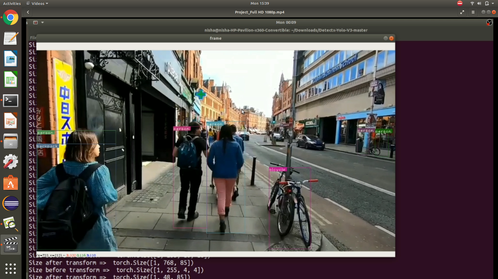

# Real-Time-Object-Detection
Object detection is one of the classical problems in computer vision.
  

# Yolo-V3
yolov3.cfg (236 MB COCO Yolo v3) - requires 4 GB GPU-RAM: https://pjreddie.com/media/files/yolov3.weights

# Dependencies
This is the list of dependencies for running this application.

 * **Torch**
 * **Pickle**
 * **argparse**
 * **Opencv**
 * **Numpy**
 * **Pandas**
  
# Some Output snaps:  
  
